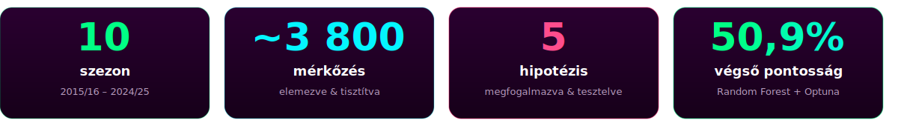
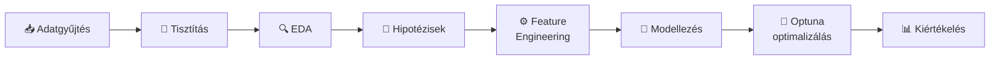
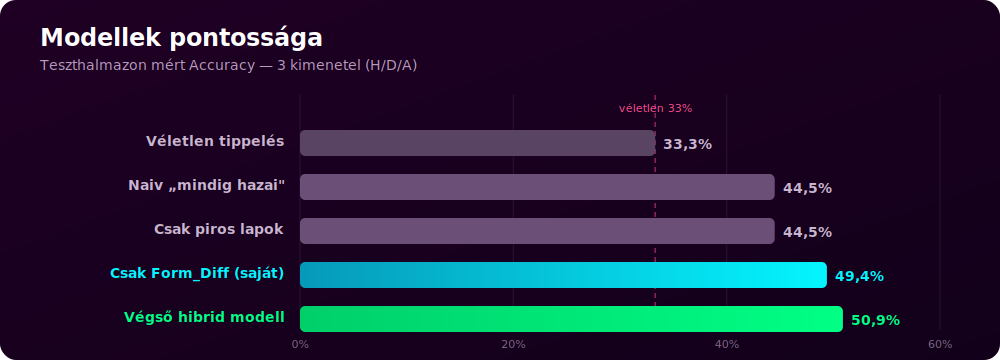
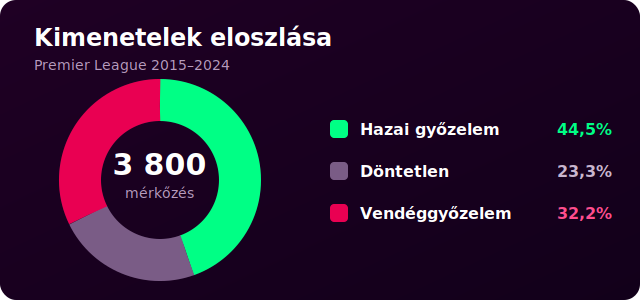
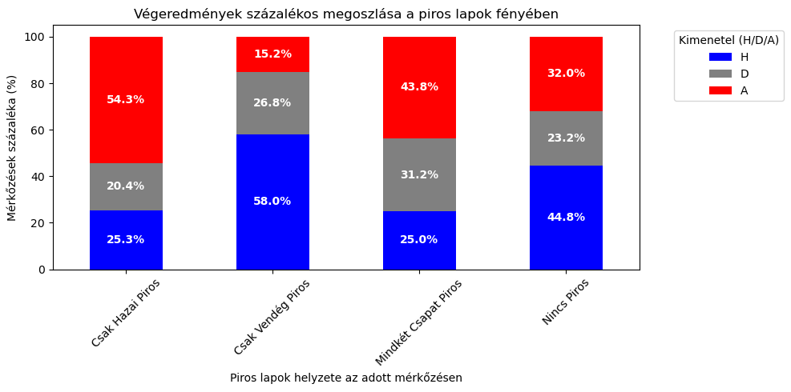
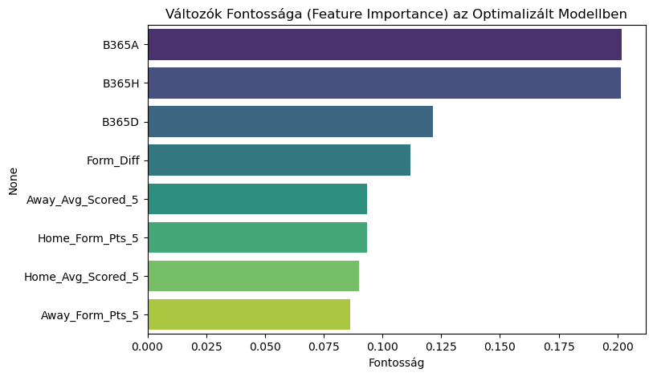
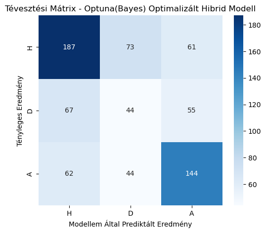
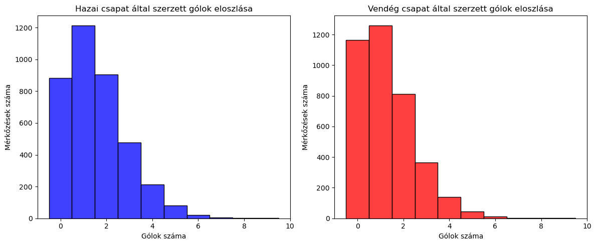

<div align="center">


<br>

<a href="#-a-projektről"></a>


<br><br>

**Feltáró adatelemzés · hipotézisvizsgálat · gépi tanulási predikció — az angol Premier League 10 szezonján**

<sub>Önálló Laboratórium · BME Villamosmérnöki és Informatikai Kar · **Németh Máté (E3YAXE)**</sub>

</div>

<br>

<div align="center">

</div>

<br>

## 📌 A projektről

Ez a projekt az angol **Premier League** mérkőzéseinek statisztikai elemzésével és a mérkőzések **kimenetelének előrejelzésével** foglalkozik. A cél a nyers, historikus mérkőzésadatoktól eljutni egy validált, hiperparaméter-optimalizált **gépi tanulási modellig**, amely a hazai győzelem (H), döntetlen (D) és vendéggyőzelem (A) valószínűségeit becsli.

A munka egy teljes adattudományi életciklust jár be:



## 📊 Adathalmaz

<table>
<tr><td><b>Forrás</b></td><td><a href="https://www.football-data.co.uk/">Football-Data.co.uk</a></td></tr>
<tr><td><b>Liga</b></td><td>Angol Premier League (E0)</td></tr>
<tr><td><b>Szezonok</b></td><td>2015/16 – 2024/25 (10 szezon)</td></tr>
<tr><td><b>Mérkőzések</b></td><td>~3 800</td></tr>
<tr><td><b>Jellemzők</b></td><td>Gólok, lövések, kaput eltaláló lövések, szögletek, lapok, játékvezető, fogadóirodai szorzók (Bet365) stb.</td></tr>
</table>

A `data/` mappa tartalmazza az egyes szezonok CSV-jét (`E0_*.csv`), valamint a notebook által generált, összefűzött és tisztított `E0_osszesitett.csv`-t.

## 🧪 Vizsgált hipotézisek

| # | Hipotézis | Eredmény |
|:-:|---|---|
| **H1** | A hazai pálya előnye egyértelmű, de a COVID (zárt kapus meccsek) csökkentette | ✅ Igazolt — hazai **44,5%** vs. vendég 32,2% |
| **H2** | A *kaput eltaláló* lövések jobban korrelálnak a gólokkal, mint az összes lövés | ✅ Igazolt — korreláció ~0,6 vs. ~0,3 |
| **H3** | A fogadóirodai szorzók (Bet365) önmagukban erős prediktorok | ✅ Igazolt — a legfontosabb jellemzők |
| **H4** | A piros lapok aszimmetrikus hatással vannak a végeredményre | ✅ Igazolt — lásd az ábrát |
| **H5** | A saját `Form_Diff` mutató önmagában megveri a véletlen tippelést (33%) | ✅ Igazolt — **49,4%** csak ezzel |

## 🎯 Eredmények egy pillantásra

<div align="center">

<br><br>

</div>

> **Kulcsmegállapítás:** pusztán alapstatisztikákkal nehéz felülmúlni a fogadóirodákat, de a szorzók és a **saját származtatott jellemzők** (forma, gólátlagok, `Form_Diff`) kombinálásával, modern optimalizációval a modell prediktív ereje és kiegyensúlyozottsága jelentősen javítható.

<details>
<summary><b>📈 További elemzési ábrák (a notebookból)</b> — kattints a kinyitáshoz</summary>
<br>
<table>
  <tr>
    <td width="50%"></td>
    <td width="50%"></td>
  </tr>
  <tr>
    <td align="center"><em>A piros lapok aszimmetrikus hatása (H4)</em></td>
    <td align="center"><em>Változók fontossága az optimalizált modellben</em></td>
  </tr>
  <tr>
    <td width="50%"></td>
    <td width="50%"></td>
  </tr>
  <tr>
    <td align="center"><em>A végső hibrid modell tévesztési mátrixa</em></td>
    <td align="center"><em>A szerzett gólok eloszlása (hazai / vendég)</em></td>
  </tr>
</table>
</details>

## 🤖 Modellezés

A predikció egy **Random Forest** osztályozóra épül, amelyet **Optuna** Bayes-i hiperparaméter-optimalizálással hangoltam, `class_weight='balanced'` beállítással a döntetlenek jobb felismerése érdekében, és **K-Fold keresztvalidációval** ellenőriztem a megbízhatóságot.

| Megközelítés | Pontosság |
|---|:-:|
| Véletlen tippelés (elméleti alap) | 33,3% |
| Naiv „mindig hazai" stratégia | ~44,5% |
| Csak piros lapok alapján | 44,5% |
| Csak `Form_Diff` (saját jellemző) | 49,4% |
| **Végső hibrid modell** (odds + FE + Optuna) | **~50,9%** · K-Fold: 53,2% |

## 🗂️ Projektstruktúra

```
premier-league-onlab/
├── notebooks/
│   └── premier_league_analysis.ipynb   # A teljes elemzés (EDA + modellezés)
├── data/
│   ├── E0_1516.csv ... E0_2425.csv      # Szezononkénti nyers adatok
│   └── E0_osszesitett.csv               # Generált, összefűzött adathalmaz
├── docs/                                # Beszámoló, prezentáció, munkaterv
├── assets/                              # Ábrák és grafikák
├── requirements.txt
└── README.md
```

## 🚀 Futtatás

```bash
git clone https://github.com/Nemmatee/premier-league-onlab.git
cd premier-league-onlab

python -m venv .venv
# Windows:  .venv\Scripts\activate
# Linux/Mac: source .venv/bin/activate

pip install -r requirements.txt
jupyter notebook notebooks/premier_league_analysis.ipynb
```

> A notebook a `data/` mappából olvassa be a szezonok CSV-jét, és szükség esetén automatikusan letölti a hiányzó adatokat a Football-Data.co.uk oldalról.

## 🔭 Továbbfejlesztési lehetőségek

- **Modern metrikák** — várható gólok (xG), PPDA, pihenőnapok, sérülések integrálása
- **Boosting modellek** — XGBoost / LightGBM a Random Forest helyett
- **Játékos-szintű adatok** — FIFA / Transfermarkt értékelések, piaci értékek bevonása

## 🛠️ Technológiák

`Python` · `pandas` · `NumPy` · `scikit-learn` · `Optuna` · `Matplotlib` · `Seaborn` · `Plotly` · `Jupyter`

---

<div align="center">

📄 Részletes beszámoló és prezentáció a **[`docs/`](docs/)** mappában

<sub>Készült az **Önálló Laboratórium** tárgy keretében · Németh Máté (E3YAXE)</sub>

</div>
