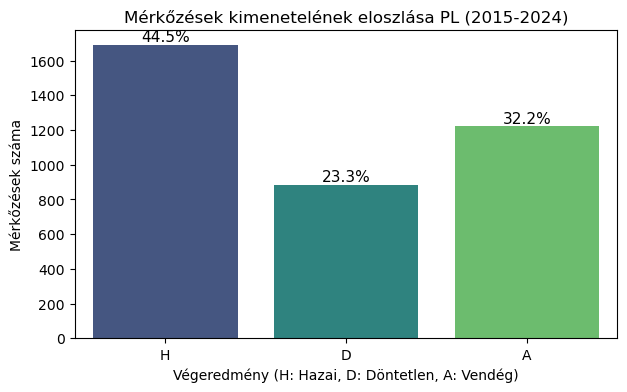

<div align="center">


# ⚽ Premier League Mérkőzések Elemzése és Prediktív Modellezése

**Feltáró adatelemzés (EDA), hipotézisvizsgálat és gépi tanulási predikció az angol Premier League 10 szezonján**

<p>
  
  
  
  
  
  
  
</p>

*Önálló Laboratórium · BME Villamosmérnöki és Informatikai Kar*
**Készítette: Németh Máté (E3YAXE)**

</div>

---

## 📌 A projektről

Ez a projekt az angol **Premier League** mérkőzéseinek statisztikai elemzésével és a mérkőzések **kimenetelének előrejelzésével** foglalkozik. A cél a nyers, historikus mérkőzésadatoktól eljutni egy validált, hiperparaméter-optimalizált **gépi tanulási modellig**, amely a hazai győzelem (H), döntetlen (D) és vendéggyőzelem (A) valószínűségeit becsli.

A munka egy teljes adattudományi életciklust jár be:

> **Adatgyűjtés → Adattisztítás → Feltáró elemzés (EDA) → Hipotézisvizsgálat → Feature Engineering → Modellezés → Optimalizálás → Kiértékelés**

## 📊 Adathalmaz

| | |
|---|---|
| **Forrás** | [Football-Data.co.uk](https://www.football-data.co.uk/) |
| **Liga** | Angol Premier League (E0) |
| **Szezonok** | 2015/16 – 2024/25 (10 szezon) |
| **Mérkőzések** | ~3 800 |
| **Jellemzők** | Gólok, lövések, kaput eltaláló lövések, szögletek, lapok, játékvezető, fogadóirodai szorzók (Bet365) stb. |

A `data/` mappa tartalmazza az egyes szezonok CSV-jét (`E0_*.csv`), valamint a notebook által generált, összefűzött és tisztított `E0_osszesitett.csv`-t.

## 🧪 Vizsgált hipotézisek

| # | Hipotézis | Eredmény |
|:-:|---|---|
| **H1** | A hazai pálya előnye egyértelmű, de a COVID (zárt kapus meccsek) csökkentette | ✅ Igazolt — hazai győzelem **44,5%** vs. vendég 32,2% |
| **H2** | A *kaput eltaláló* lövések jobban korrelálnak a gólokkal, mint az összes lövés | ✅ Igazolt — korreláció ~0,6 vs. ~0,3 |
| **H3** | A fogadóirodai szorzók (Bet365) önmagukban erős prediktorok | ✅ Igazolt — a legfontosabb jellemzők a modellben |
| **H4** | A piros lapok aszimmetrikus hatással vannak a végeredményre | ✅ Igazolt — lásd az ábrát alább |
| **H5** | A saját `Form_Diff` mutató önmagában megveri a véletlen tippelést (33%) | ✅ Igazolt — **49,4%** pontosság csak ezzel a változóval |

## 📈 Néhány kiemelt eredmény

<table>
  <tr>
    <td width="50%"></td>
    <td width="50%"></td>
  </tr>
  <tr>
    <td align="center"><em>Mérkőzés-kimenetelek eloszlása (H/D/A)</em></td>
    <td align="center"><em>A piros lapok aszimmetrikus hatása a végeredményre</em></td>
  </tr>
  <tr>
    <td width="50%"></td>
    <td width="50%"></td>
  </tr>
  <tr>
    <td align="center"><em>Változók fontossága az optimalizált modellben</em></td>
    <td align="center"><em>A végső hibrid modell tévesztési mátrixa</em></td>
  </tr>
</table>

## 🤖 Modellezés és eredmények

A predikció egy **Random Forest** osztályozóra épül, amelyet **Optuna** Bayes-i hiperparaméter-optimalizálással hangoltam, `class_weight='balanced'` beállítással a döntetlenek jobb felismerése érdekében, és **K-Fold keresztvalidációval** ellenőriztem a megbízhatóságot.

| Modell / megközelítés | Pontosság (Accuracy) |
|---|:-:|
| Véletlen tippelés (elméleti alap) | 33,3% |
| Naiv „mindig hazai" stratégia | ~44,5% |
| Csak piros lapok alapján | 44,5% |
| Csak `Form_Diff` (saját jellemző) alapján | 49,4% |
| **Végső hibrid modell (odds + feature engineering, Optuna)** | **~50,9%** (K-Fold: 53,2%) |

> **Kulcsmegállapítás:** pusztán alapstatisztikákkal nehéz felülmúlni a fogadóirodákat, de a szorzók és a **saját származtatott jellemzők** (forma, gólátlagok, `Form_Diff`) kombinálásával, modern optimalizációval a modell prediktív ereje és kiegyensúlyozottsága jelentősen javítható.

## 🗂️ Projektstruktúra

```
premier-league-onlab/
├── notebooks/
│   └── premier_league_analysis.ipynb   # A teljes elemzés (EDA + modellezés)
├── data/
│   ├── E0_1516.csv ... E0_2425.csv      # Szezononkénti nyers adatok
│   └── E0_osszesitett.csv               # Generált, összefűzött adathalmaz
├── docs/
│   ├── Nemeth_Mate_onlab_beszamolo.pdf  # Írásos beszámoló
│   ├── prezentacio.pdf / .pptx          # Prezentáció
│   ├── dokumentacio.docx                # Dokumentáció
│   └── munkaterv.pdf / .docx            # Munkaterv
├── assets/                              # Ábrák a README-hez
├── requirements.txt
└── README.md
```

## 🚀 Futtatás

```bash
# 1) Repó klónozása
git clone https://github.com/Nemmatee/premier-league-onlab.git
cd premier-league-onlab

# 2) (Ajánlott) virtuális környezet
python -m venv .venv
# Windows:
.venv\Scripts\activate
# Linux/macOS:
source .venv/bin/activate

# 3) Függőségek telepítése
pip install -r requirements.txt

# 4) Notebook indítása
jupyter notebook notebooks/premier_league_analysis.ipynb
```

> A notebook a `data/` mappából olvassa be a szezonok CSV-jét, és szükség esetén automatikusan letölti a hiányzó adatokat a Football-Data.co.uk oldalról.

## 🔭 Továbbfejlesztési lehetőségek

- **Modern metrikák**: várható gólok (xG), PPDA, pihenőnapok, sérülések integrálása.
- **Boosting modellek**: XGBoost / LightGBM kipróbálása a Random Forest helyett.
- **Játékos-szintű adatok**: FIFA / Transfermarkt értékelések, piaci értékek bevonása.

## 🛠️ Használt technológiák

`Python` · `pandas` · `NumPy` · `scikit-learn` · `Optuna` · `Matplotlib` · `Seaborn` · `Plotly` · `Jupyter`

---

<div align="center">

📄 **Dokumentáció:** részletes beszámoló és prezentáció a [`docs/`](docs/) mappában.

*Készült az Önálló Laboratórium tárgy keretében — Németh Máté (E3YAXE)*

</div>
